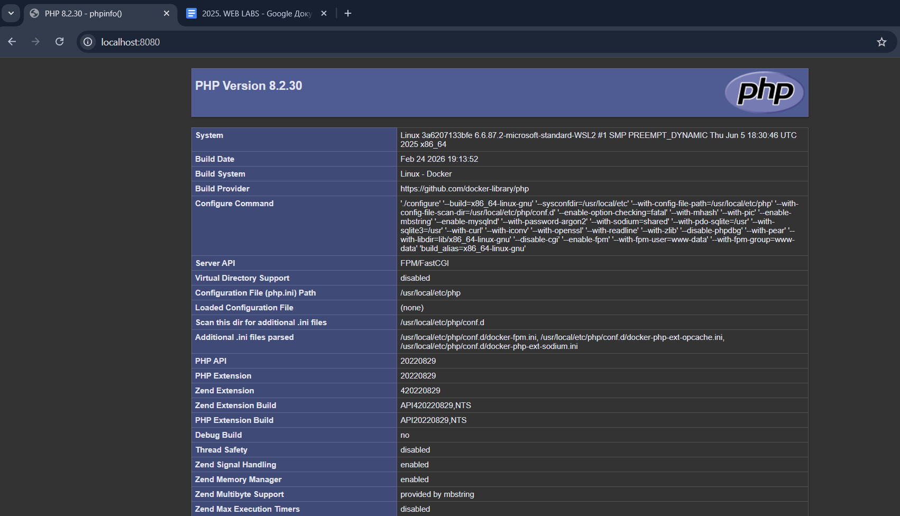
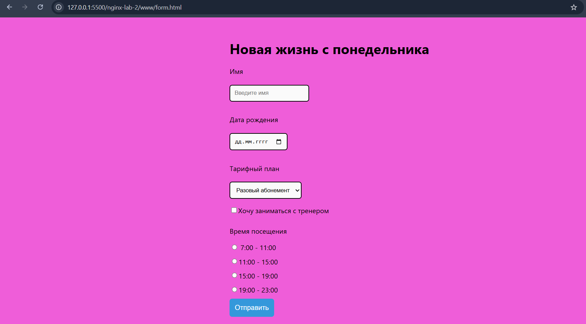
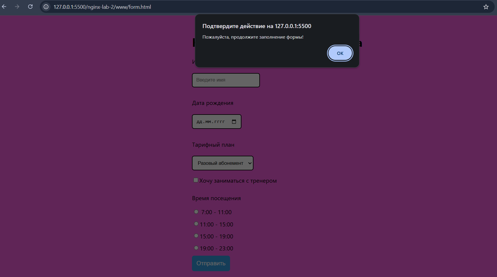

# Laboratory work №1: HTML + JS + PHP
# option 10
Create a gym registration form using JS, CSS, and HTML.

## 💃 Author
Merkulova Elizaveta, AM-2

## 🍽️ Project content

```docker-compose.yml``` — Nginx description

```nginx.conf``` — Nginx configuration

```www/index.php``` — PHP page

```www/form.html``` — registration form

```screenshots/``` — all screenshots

## 📸 Screenshots




## 🎉 Result
PHP info added, registration form created, design modified using CSS, page appearance animation added, action reminder added using JavaScript.
